        林氏物语.技术乱弹之hive源码之词法语法解析(MD版格式已乱 请查看docx版)

  

[第一章              前言... 1](#_Toc368923110)

[第二章              准备工作... 2](#_Toc368923111)

[第三章              总体概览... 4](#_Toc368923112)

[第一节      hive官方架构图... 4](#_Toc368923113)

[第二节     流程处理图... 4](#_Toc368923114)

[第三节     具体框架图... 6](#_Toc368923115)

[第四章              语法分析... 6](#_Toc368923116)

[第一节     快速定位词法语法分析的位置的方法... 6](#_Toc368923117)

[第二节     语法文件之间的关系... 8](#_Toc368923118)

[第三节     静态分析语法文件的方法... 9](#_Toc368923119)

[第四节     动态分析语法文件的方法... 14](#_Toc368923120)

[第五章              语义分析阶段... 16](#_Toc368923121)

[第一节     语义处理模块的关系... 17](#_Toc368923122)

[第二节     高端大气的模板方法模式... 18](#_Toc368923123)

[第三节      SemanticAnalyzer的实现过程... 20](#_Toc368923124)

[第1小节     处理位置别名... 21](#_Toc368923125)

[第2小节     分析创建表命令... 23](#_Toc368923126)

[第3小节     分析创建视图命令... 26](#_Toc368923127)

[第4小节     第一阶段分析... 26](#_Toc368923128)

[第1小小节     处理逻辑流程... 26](#_Toc368923129)

[第2小小节     构造覆盖大多数子节点的例子... 28](#_Toc368923130)

[第3小小节      select从句的处理(TOK\_SELECTDI和 TOK\_SELECT节点) 29](#_Toc368923131)

[第4小小节     关于自定义函数的插曲... 33](#_Toc368923132)

[第5小小节     其他的token的处理... 33](#_Toc368923133)

[第5小节     产生执行计划... 34](#_Toc368923134)

[第6小节     根据选项设置的优化器进行优化... 34](#_Toc368923135)

[第7小节     产生mr执行任务... 34](#_Toc368923136)

 

第一章         前言
-------------------

   我们知道 hive是一个基于hadoop上面提供了类sql的接口的组件，以方便熟悉sql的人使用hadoop，对大数据的处理。限于精力，本文只关注hive所提供的语法，它解析语法的过程，以及生成执行计划和优化这几个过程。

  本文可以作为antlr实现的高级进阶教程，亦可以作为hive的源码分析教程，毕竟，语法词法解析，执行计划的生成优化以及执行也是hive的核心。这不是定位不清晰，而是我有这样的需求，既想了解antlr的具体使用，又想深入了解hive。

   本文所用到的自绘的图尽量采用graphviz生成，考虑到他们放入word会失真，所以给提供了最原始的生成文件，你可以按照自己的需要生成各种格式，他们都存放在dot\_file的目录下。

   最后，本文随时会根据作者的喜好和发现而做调整，如果你觉得那些地方不妥，请来信指正或者指教:workspace.public@gmail.com

 

第二章         准备工作
-----------------------

分析对象:hive源代码，版本Revision 1522497

需要用到的工具： svn ant  antlr-3.5-complete.jar，antlrworks-1.4.2.jar，eclipse。

注：在http://www.antlr3.org/download.html  可以下载antlr-3.5-complete.jar，antlrworks-1.4.2.jar.

hive中使用到的antlr是 v3.4版本的，使用v3.5没有问题，但请别使用v4.0的。

 

下载源代码,并编译

svn co http://svn.apache.org/repos/asf/hive/trunk hive

cd hive

~~~~ {style="background:white"}
ant clean package eclipse-files
~~~~

最后一个是为了方便导入成eclipse项目，有些人是喜欢用eclipse查看源代码。

 

安装部署好分布式的hadoop，并安装好hive。可以跑例子...具体的可以参考网络上的教程,一搜一大把。

文中准备的是官方网的测试数据。所以你需要执行以下语句:

CREATE TABLE invites (foo INT, bar STRING) PARTITIONED BY (ds STRING);

LOAD DATA LOCAL INPATH '../examples/files/kv2.txt' OVERWRITE INTO TABLE invites PARTITION (ds='2008-08-15');

LOAD DATA LOCAL INPATH '../examples/files/kv3.txt' OVERWRITE INTO TABLE invites PARTITION (ds='2008-08-08');

 

注意:数据文件在本地的位置要根据你启动hive的不同而改变。

 

第三章         总体概览
-----------------------

### 第一节         hive官方架构图

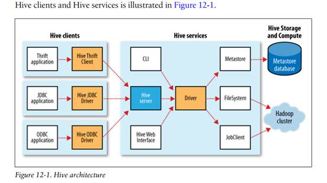

摘自 hadoop 权威指南

 

### 第二节         流程处理图

  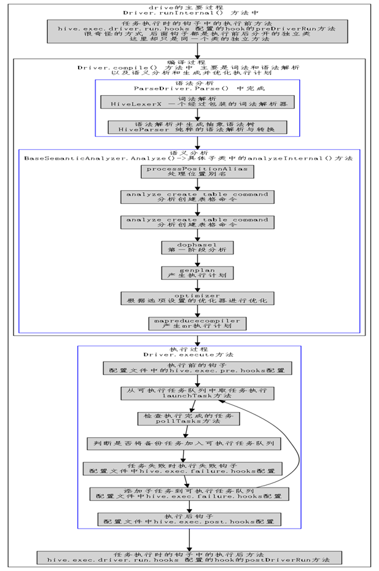

这张图是从源代码中剥茧抽丝的出来的抽象，忽略掉了无关紧要的细节。

这张图描述了 hive从解析语句到执行的过程。 后续的内容会以为大纲详细展开。

### 第三节         具体框架图

(待完善)

 

第四章         语法分析
-----------------------

    对一个已有的项目进行语法分析，首先是要找到语法分析文件，分析语法文件之间的关系，然后根据语法分析文件提供的接口，确定语法解析在这个体系中所处的位置。

    在分析语法文件的时候，一般常用两种分析方法 静态分析和动态分析方法。静态分析方法常见是读语法文件， 或者使用可视化工具查看语法文件。动态分析方法是运行该解析程序，查看运行过程中语法识别的情况以及相关的具体语法树的构建过程以及抽象语法树构建过程(如果可能有抽象语法树的话)。

 

### 第一节         快速定位词法语法分析的位置的方法

搜索 .g的位置

find ./ -name "\*.g"

会得到

./ql/src/java/org/apache/hadoop/hive/ql/parse/FromClauseParser.g

./ql/src/java/org/apache/hadoop/hive/ql/parse/SelectClauseParser.g

./ql/src/java/org/apache/hadoop/hive/ql/parse/HiveParser.g

./ql/src/java/org/apache/hadoop/hive/ql/parse/IdentifiersParser.g

./ql/src/java/org/apache/hadoop/hive/ql/parse/HiveLexer.g

./metastore/src/java/org/apache/hadoop/hive/metastore/parser/Filter.g

基本可以确定了 ql下面就是需要找到东西。

find . -name "\*.java" |xargs grep "HiveLexer "

找到两处

./build/ql/gen/antlr/gen-java/org/apache/hadoop/hive/ql/parse/HiveLexer.java:public class HiveLexer extends Lexer {

./ql/src/java/org/apache/hadoop/hive/ql/parse/ParseDriver.java:  public class HiveLexerX extends HiveLexer {

 

其中第一处是编译期构建的， 而另外一处是包装了该类。重点可以放到第二处。也即parseDriver类。

 

对parseDriver类做一个大致的分析，

包装了antlr的antlrStringStream 成为antlrnocasestream。消除了大小写敏感。

包装了词法解析器 HiveLexer，主要是包装了出错信息。

包装了抽象树节点，主要聚合了ASTNodeOrigin 以求能获得对象类型，名字，定义，别名，和定义。

其中parser方法是我们重点关注的，它调用词法解析和语法解析。

察看其所有的调用者的关系形成的路径，找到一条通向cli的包的clidriver类main方法，（可以通过eclipse的北调用关系反向查看）

clidriver.run() -\>clidriver.executeDriver()-\>clidriver.processLine(string,boolean)-\>clidriver.processCmd()-\>clidriver.processloaclcmd()-\>driver.run-\>driver.runInternal()-\>driver.compile()-\>parserdriver.parse

 

而我们知道这也是其中的入口之一。 基本上可以快速的确定其所用到的词法语法解析了。

 

### 第二节         语法文件之间的关系

翻阅几个.g文件可以得知

HiveLexer.g 是做词法分析的，定义了所有用到的token。

HiveParser.g 是做语法解析的。

FromClauseParser.g  from从句语法解析

SelectClauseParser.g  select 从句语法解析。

IdentifiersParser.g  自定义函数的解析，hive中的自定义函数范围很广，各种内建的库函数，包括操作符之类的都被归为自定义的函数，而在语义解析的时候给以甄别。

 

关系图:

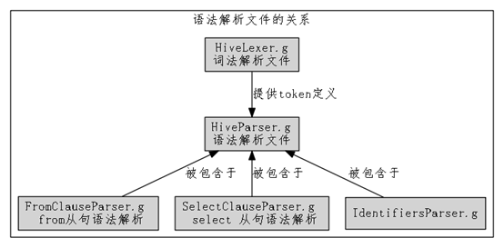

 

熟悉antlr v3的朋友一般会奇怪，为什么这里的词法语法怎么不是在一个文件，或者词法语法结对出现呢？ 这里面用到了一种叫composite grammars的技术。 这种高级货是antlr v3.1开始引进的。 是为了解决把所有语法塞入到一个文件里导致编译出来的java文件过大和逻辑多了之后不容易阅读的问题。它允许在逻辑上把一个大语法划分成几大块，独立实现，然后合并在一起。

HiveParser.g 有一行  import SelectClauseParser, FromClauseParser, IdentifiersParser;  类似于 c中的 include SelectClauseParser.g, FromClauseParser.g, IdentifiersParser.g

 

### 第三节         静态分析语法文件的方法

分析一个词法语法的实现，最好的方式是跟随着语法规则走读一边逐一标注。

当然，更快捷有效的方式是在静态分析方面使用一些可视化的工具来察看语法结构如语法图，

##### 第1小小节           使用antlrworks来查看语法结构

具体的使用初学者请参照

http://www.github.com/alan2lin/hand\_in\_hand\_with\_antlr

中的安装与使用。

 

hivelexer不需要关注太多，就是识别关键字和token的，重点是 hiveparser。

##### 第2小小节           antlr语法的简单介绍

关于antlr语法规范，详细请参见 hand in hand with antlr中的语法规范的翻译。

这里只做简单的介绍，以便没有基础的人也可以读懂。

 

parser grammar HiveParser;    

//标准格式 parser grammar 后面跟语法名。

 

options //选项

{

tokenVocab=HiveLexer;  //词汇表来源于 HiveLexer

output=AST;      //输出 抽象语法树

ASTLabelType=CommonTree;  //抽象语法树类型为 commonTtree

backtrack=false;  //不回溯

k=3;   //前向窥看3个token的长度。

}

import SelectClauseParser, FromClauseParser, IdentifiersParser;

//map建立的过程....省略

 

 

//整个规则由statement开始。 statement 由 解释语句explainStatement或执行语句execStatement组成。这种形式叫产生式 冒号左边的是左部，作为代表这个产生式规则的符号。 冒号右边是右部， 连接符号  | 表示 右部的组成部分是或者的关系，还有另一种解读的意思是:从statement开始，产生了 explainstatement 或者 execstatement。

// starting rule

statement

       : explainStatement EOF

       | execStatement EOF

       ;

//解释语句 explainStatement 由KW\_EXPLAIN 开始 中间有可选项 KW\_EXTENDED，KW\_FORMATTED  KW\_DEPENDENCY KW\_LOGICAL ， 后面紧跟着 执行语句 。

通过观测，KW\_ 开始的token代表 关键字。

语法形式:

@init 表示进入规则时执行后面的{}里的动作 ，例中，压入trace的消息。

@after{} 表示规则完成后执行{}里面的动作。  例中，弹出trace的消息。

-\>构建语法抽象树 \^(rootnode  leafnode1 leafnode2...) 如例 表示构建一个以 TOK\_EXPLAIN 为根节点   execStatement 为第一个叶结点， 可选项为第二个叶结点，如果有可选项的话。

explainOptions=KW\_EXTENDED 定义了 explainOptions作为别名引用KW\_EXTENDED， 引用形式为 \$ explainOptions.

 

explainStatement

@init { msgs.push("explain statement"); }

@after { msgs.pop(); }

       : KW\_EXPLAIN (explainOptions=KW\_EXTENDED|explainOptions=KW\_FORMATTED|explainOptions=KW\_DEPENDENCY|explainOptions=KW\_LOGICAL)? execStatement

      -\> \^(TOK\_EXPLAIN execStatement \$explainOptions?)

       ;

 

//执行语句execStatement 由 查询，装载，导出，导入，数据定义 四大语句。

 

execStatement

@init { msgs.push("statement"); }

@after { msgs.pop(); }

    : queryStatementExpression

    | loadStatement

    | exportStatement

    | importStatement

    | ddlStatement

    ;

 

//装载语句 只关注 路径，表或分区， 是否定义了本地， 是否定义了重写。

loadStatement

@init { msgs.push("load statement"); }

@after { msgs.pop(); }

    : KW\_LOAD KW\_DATA (islocal=KW\_LOCAL)? KW\_INPATH (path=StringLiteral) (isoverwrite=KW\_OVERWRITE)? KW\_INTO KW\_TABLE (tab=tableOrPartition)

    -\> \^(TOK\_LOAD \$path \$tab \$islocal? \$isoverwrite?)

    ;

 

//导出语句 只关注 表或分区 和导出路径

exportStatement

@init { msgs.push("export statement"); }

@after { msgs.pop(); }

    : KW\_EXPORT KW\_TABLE (tab=tableOrPartition) KW\_TO (path=StringLiteral)

    -\> \^(TOK\_EXPORT \$tab \$path)

    ;

 

//导入语句 只关注导入路径，表或着分区， 是否是外部

importStatement

@init { msgs.push("import statement"); }

@after { msgs.pop(); }

       : KW\_IMPORT ((ext=KW\_EXTERNAL)? KW\_TABLE (tab=tableOrPartition))? KW\_FROM (path=StringLiteral) tableLocation?

    -\> \^(TOK\_IMPORT \$path \$tab? \$ext? tableLocation?)

    ;

以此类推，不再累述。

### 第四节         动态分析语法文件的方法

这里介绍一种更为直观的的方法，把.g中的语义动作清除，然后用antlrworks查看，并调试。

在antlrworks中能够以图形的方式展示语法结构(只限于一个规则一个规则的显示图)

如

 

或者具体语法分析和生成的语法解析树，

例如，官网中的例子 SELECT a.foo FROM invites a WHERE a.ds='2008-08-15'

生成的具体语法树:

生成的抽象语法树:

 

要想了解语法，只能逐一解读，别无它法。而这种产生式是最简约的描述信息了，就不重复贴出来了。附件是清理后的 .g文件，可直接使用。

好吧，如果你真的读完了，你所能得到的也只是hive ql手册能提供的语法功能，当然，额外奖励是，你知道这些功能是如何更具体的被描述的。

 

第五章         语义分析阶段
---------------------------

从hive官方结构图也能看出来，driver类是关键。

本章节按照处理流程图中的阶段依次展开。

### 第一节         语义处理模块的关系

语义模块的输入是一个抽象语法树，

输出也是一个抽象语法树，但是被修剪变换过的.

hive采用了工厂模式来实现语义模块之间的关系。

工厂根据抽象语法树的根节点来生产具体的语义处理器。如图:

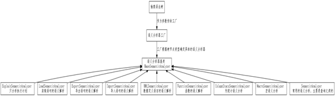

 

各个具体实现类的具体意义如表格所示:

语义分析器的实现类

实现意义

ExplainSemanticAnalyzer

只分析执行计划

LoadSemanticAnalyzer

装载语句的语义解析

ExportSemanticAnalyzer

导出语句的语义解析

ImportSemanticAnalyzer

导入语句的语义解析

DDLSemanticAnalyzer

数据定义语言的语义解析

FunctionSemanticAnalyzer

函数的语义解析

ColumnStatsSemanticAnalyzer

列统计语义分析

MacroSemanticAnalyzer

宏语义分析

SemanticAnalyzer

常用的语义分析，主要是查询。

 

具体的语义处理器与根节点的操作类型的对应关系

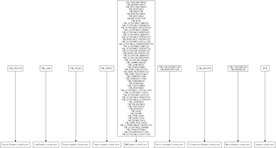

 

由于具体的实现非常多，所以这里只抽取了最常见的 SemanticAnalyzer 做具体的解析。其他的具体语义分析器，有时间我再继续。

### 第二节         高端大气的模板方法模式

    在hive的源码中的，源码清晰可读多数归结于运用了模板方法模式。无论是在driver的runinternal方法中 还是在compile方法中，都可见其痕迹。使用这种方法的好处是，能够将层级的边界界定的很清晰，对于每一个层级，都抽象出顶级逻辑作为骨架，顶级逻辑层的每一步骤，皆可留待具体方法或者具体实现类去实现，这种方式也能够清晰的界定每一个逻辑步骤的边界。

    对待这种模式解析的最佳方法就是擒贼先擒王，找到顶级逻辑的骨架，一切即可迎刃而解。

  源码中的关于可配置的钩子的实现方式，都是使用这种方法。

例如代码:

      List\<HiveSemanticAnalyzerHook\> saHooks =

          getHooks(HiveConf.ConfVars.*SEMANTIC\_ANALYZER\_HOOK*,

              HiveSemanticAnalyzerHook.**class**);

 

      // Do semantic analysis and plan generation

      **if** (saHooks != **null**) {

        HiveSemanticAnalyzerHookContext hookCtx = **new** HiveSemanticAnalyzerHookContextImpl();

        hookCtx.setConf(conf);

        **for** (HiveSemanticAnalyzerHook hook : saHooks) {

          tree = hook.preAnalyze(hookCtx, tree);

        }

        sem.analyze(tree, ctx);

        hookCtx.update(sem);

        **for** (HiveSemanticAnalyzerHook hook : saHooks) {

          hook.postAnalyze(hookCtx, sem.getRootTasks());

        }

      } **else** {

        sem.analyze(tree, ctx);

      }

 

浓缩起来 其实就是三个逻辑步骤

执行前置钩子

执行分析

执行后置钩子

 

### 第三节         SemanticAnalyzer的实现过程

在BaseSemanticAnalyzer. analyze()函数中，也同样的用了模板方法模式。

  **public** **void** analyze(ASTNode ast, Context ctx) **throws** SemanticException {

    initCtx(ctx);

    init();

    analyzeInternal(ast);

  }

这一层的逻辑很简单，initctx和init都是基本方法，而analyzeInternal 是抽象方法，由子类实现。

它的实现过程，也就是我们最关注的。

参照流程处理中的图。我们对每一个阶段进行详细展开。

 

#### 第1小节      处理位置别名

定位到TOK\_SELECT 所在的那个层级的节点。对group by 或者 order by中使用到的位置别名进行替换。不断的进行这个操作。直到遍历完树。

通过例子，我们可以清晰的看到这个处理过程。

在antlrwork中执行（请注意，hive中在进行语法解析之前将token全部转换成大写了，所以关键字要用大写，否则通不过语法校验）

SELECT foo ,count(bar) FROM invites GROUP BY foo;

和

SELECT foo ,count(bar) FROM invites GROUP BY 1;

第二条语句并不能在hive中执行，在生成执行计划的时候抛出了异常，这个可能是它们的一个bug。我们之后如有时间再进行分析，本节的重点是揭示hive如何处理位置别名的。

 

SELECT foo ,count(bar) FROM invites GROUP BY foo;的抽象语法树

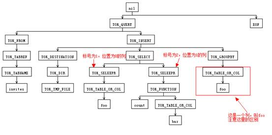

SELECT foo ,count(bar) FROM invites GROUP BY 1;的抽象语法树

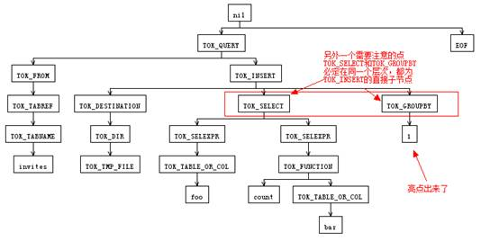

processPositionAlias 函数遍历每一个节点的子树，在隐含着TOK\_SELECT,TOK\_GROUPBY,TOK\_ORDERBY 必在同一个层级，以及后两者不能并存的前提下,如果它们有的话。对后两者存在的，以数字来标识列位置的标示符号进行替换，替换为TOK\_SELECT所对应的真实的列，他们可能是一个计算列。替换的过程是列标号所对应位置的TOK\_SELEEXPR的子节点。上例中是 拷贝 TOK\_TABLE\_OR\_COL以及子节点foo 替换掉 1.

有兴趣的可以尝试一下

SELECT foo ,bar  FROM invites order BY foo desc;

SELECT foo ,bar  FROM invites order BY 1 desc;

其中第二句可以通过语法解析和语义解析，但是结果非预期，可能是其中的bug。在后续的分析过程中将会尝试解开这个原因。

 

 

#### 第2小节      分析创建表命令

    如果当前的抽象语法树的节点是 TOK\_CREATETABLE那么将进入分析创建表命令的处理过程。

    有三种创建表的情况，

1)  正常的create-table语句。

 例如 CREATE TABLE invites (foo INT, bar STRING) PARTITIONED BY (ds STRING);

2)  create-table-like 语句。

例如 CREATE TABLE x LIKE invites;

3)  create-table-as-select 语句。

例如 CREATE TABLE y AS SELECT \* FROM invites;

 

这个阶段的语义分析主要是语义检查。

1)  检查，create-table-like 与 create-table-as-select 不能共存，不能够 创建一个 table like xx 而又 as select ...

2)  检查 create-table-like 与 create-table-as-select，确定它们不能有列名。换句话说，这两种情况创建的表的模式都是拷贝过来的。

 

以及语义动作:

1)  如果是create-table 和 create-table-like 这两种情况，它们只是影响了元数据，属于ddl的范围，直接交由 ddlwork去处理，返回null结束处理。

2)  如果是create-table-as-select则需要获取元信息并存入qb，返回select语句所在的树，表示后续还需要处理。

3)  填充默认的存储格式，对不同的文件格式 ，顺序文件 rcfile orc等之类的文件设置他们的输入格式类和输出格式类以及序列化反序列化类。

4)  创建表描述，存入qb中。

 

列出这三种情况的抽象语法树， 分析一下处理流程

CREATE TABLE invites (foo INT, bar STRING) PARTITIONED BY (ds STRING)

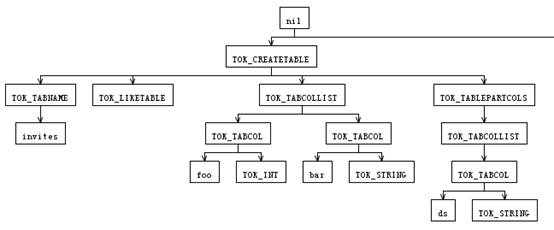

CREATE TABLE x LIKE invites

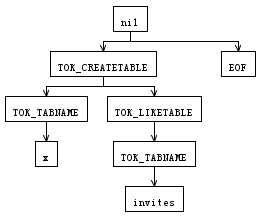

 

CREATE TABLE y AS SELECT \* FROM invites

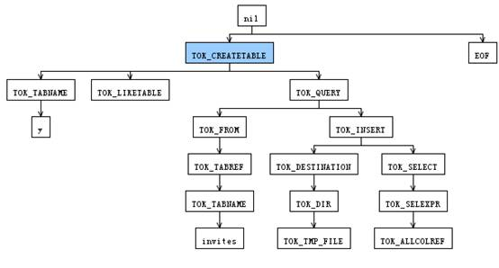

 

分析建表命令处理过程会逐一处理TOK\_CREATETABLE下面的字节点，从第二个字节点开始处理。

如果是create-table  ，就把从TOK\_TABCOLLIST取出列定义来创建来表描述。

如果是create-table-like，就取出like表名，用来创建表描述。

如果是create-table-as-select 也是从目标表明创建表描述，同时将TOK\_QUERY 指向的节点返回。

 

#### 第3小节      分析创建视图命令

     如果TOK\_CREATEVIEW 和TOK\_ALTERVIEW\_AS 两个节点，则进入分析创建视图命令过程。

     相对于分析创建表命令而言，分析视图创建就很简单了，得到得到各列以及若干属性，用来创建视图描述，然后交由ddlwork处理，同时返回TOK\_QUERY 节点。本节从简。

#### 第4小节      第一阶段分析

    dophase1 比较复杂，因为涉及处理的节点类型比较多，影响的上下文也比较多。

##### 第1小小节           处理逻辑流程

   先来看看dophase1的逻辑... 我将逻辑简化掉，以便能清楚的看清这个流程。

public boolean doPhase1(ASTNode ast, QB qb, Phase1Ctx ctx\_1)

    boolean phase1Result = true;

    boolean skipRecursion = false;

    if (ast.getToken() != null) {

      skipRecursion = true;

      switch (ast.getToken().getType()) {

case HiveParser.TOK\_XXX: maychange(skipRecursion);

                 break;

**default**:

        skipRecursion = **false**;

        **break**;

}

    **if** (!skipRecursion) {

      **int** child\_count = ast.getChildCount();

      **for** (**int** child\_pos = 0; child\_pos \< child\_count && phase1Result; ++child\_pos) {

        phase1Result = phase1Result && doPhase1((ASTNode) ast.getChild(child\_pos), qb, ctx\_1);

      }

    }

    **return** phase1Result;

逻辑清晰地显示， dophase1 采用先根的方式递归遍历抽象语法树，从左右到右边递归处理子节点。

递归的出口是 在某些个节点上设置的skipRecursion，以及子节点处理的结果。

这里面尤其要注意的是default的处理，也就是，如果这个token 没有匹配的，就忽略过递归处理。

##### 第2小小节           构造覆盖大多数子节点的例子

先构造一个覆盖比较多的sql，通过观察它生成的抽象语法树来进行解析。特别声明，这个语句没啥含义，只是为了 覆盖多一点的分支情况，同时是可以通过语法调试的。这个无意构造的语句居然还能够检测出一个运行时的异常。

SELECT \* FROM

(SELECT foo,COUNT(ISNULL(bar)) OVER(PARTITION BY foo ORDER BY foo)  FROM invites WHERE ds='2008-08-15'  ) a

JOIN

(SELECT foo,COUNT(bar) FROM invites GROUP BY foo) b

ON a.foo = b.foo  ORDER BY a.foo ;

生成的抽象语法树图形如下:

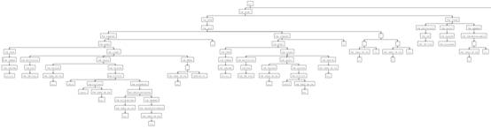

这图太小了，最好还是把语句放入 antlrworks中查看吧，可以任意放大...

下面就开始各个子节点的处理

##### 第3小小节           select从句的处理(TOK\_SELECTDI和 TOK\_SELECT节点)

    先上图，无码高清的请到dot\_file文件夹去看...

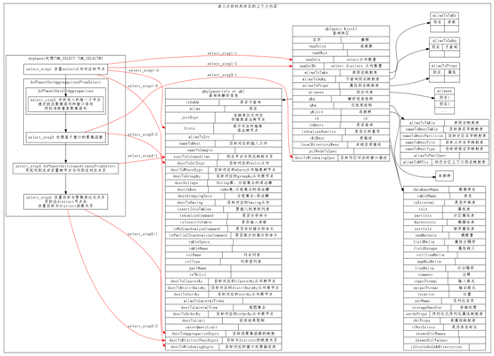

上图左边是select selecctdi的处理阶段的步骤，右边是 query block 和queryblock parserinfo的内容，

上图清晰的展示出对TOK\_SELECT TOK\_SELECTDI为根节点的语义处理，以及涉及的那些上下文的内容。

1)   step1 增加select/select distinct的计数器 ，若有hints，设置hints。

2)  step2  对select节点孙子节点进行遍历，递归寻找聚集函数和窗口。并对自定义函数是否要求隐含排序进行语义检查。

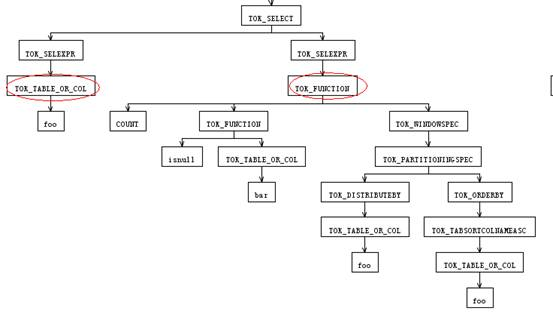

这一步主要是对tok\_select的孙节点层进行递归遍历，处理tok\_function和 tok\_functiondi 和tok\_functionstar节点。如果改节点下面是 tok\_windowspec则认为是窗口函数，填充到出口参数，返回。如果是identifier 则认为是自定义函数，hive中的自定义函数范围挺广的，包含常见的运算符等都是以自定义函数的方式实现的。从函数注册信息中去判断自定义函数是否需要隐含排序的条件，如果有，此时肯定缺少了over从句，因为over从句会被语法解析转换成tok\_windowspec了

语法是这样处理的，在identifiersParser文件中

// fun(par1, par2, par3)

function:

    functionName

    LPAREN

      (

        (star=STAR)

        | (dist=KW\_DISTINCT)? (selectExpression (COMMA selectExpression)\*)?

      )

    RPAREN (KW\_OVER ws=window\_specification)?

           -\> {\$star != null}? \^(TOK\_FUNCTIONSTAR functionName \$ws?)

           -\> {\$dist == null}? \^(TOK\_FUNCTION functionName (selectExpression+)? \$ws?)

                            -\> \^(TOK\_FUNCTIONDI functionName (selectExpression+)?)

    ;

从中可以看出window\_specification是跟在KW\_OVER后面的，而在整个的.g文件范围内， window\_specification 除了在定义窗口的时候，就只有在此处被引用了。

window\_specification:

  (Identifier | ( LPAREN Identifier? partitioningSpec? window\_frame? RPAREN))

-\> \^(TOK\_WINDOWSPEC Identifier? partitioningSpec? window\_frame?);

可以清楚的看出若是over从句，tok\_function 子节点最右边必定是 tok\_windowspec，而如果是tok\_windowspec在前面就被返回去了，走不到这里。故出现在此，而函数注册信息中要求隐含排序，也即是要求窗口的，而窗口是在over从句中出现的，此刻可以判断为缺少over从句。

 

语义检查中很多都是使用这样的方式，把具体语法的多种表现形式尽可能变换成统一的一致的抽象语法树形式，比如 加减乘除四种二元操作，变换成（操作数1，操作符号，操作数2）这种抽象形式， 当然抽象树表现的方式是 \^(操作符号  操作数1 操作数2)，把优先级变换成节点遍历的顺序。

 

3)  step3 如果是基于窗口的函数，则创建窗口描述或者对已有的窗口描述进行填充。同时对基于窗口的聚集函数创建窗口函数描述类，将这两者更新到qb. destToWindowingSpec和qbp. destToWindowingExprs中。

窗口相关的类结构如图:

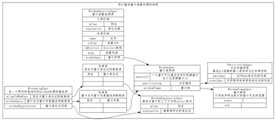

 

4)  step4和step5 只是简单的设置，代码也很简单，就不累述了。

 

在这几步的处理过程中需要注意的是，

dophase1的函数参数中有一个特殊的上下文 专门为该函数准备的

叫Phase1Ctx{ String dest; int nextNum;} dest在初始化的时候是"reduce" 只有在 TOK\_DESTINATION 会被改变。

 

##### 第4小小节           关于自定义函数的插曲

先留一个位置，回头再行展开。

 

##### 第5小小节           from从句的处理

 

##### 第6小小节           其他的token的处理

其他的token都是更新了上下文中的qb 和qbp，偶尔做一些简单的语义校验， 直接上图就好了， 图示比较清晰。

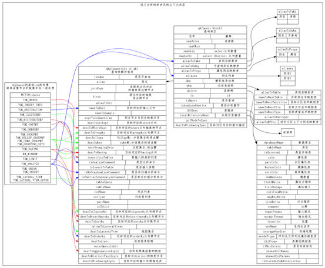

 

 

#### 第5小节      产生执行计划

#### 第6小节      根据选项设置的优化器进行优化

#### 第7小节      产生mr执行任务

 

参考的引用

https://cwiki.apache.org/confluence/display/Hive/GettingStarted

https://cwiki.apache.org/confluence/display/Hive/GettingStarted+EclipseSetup

 

 

 

 

 
